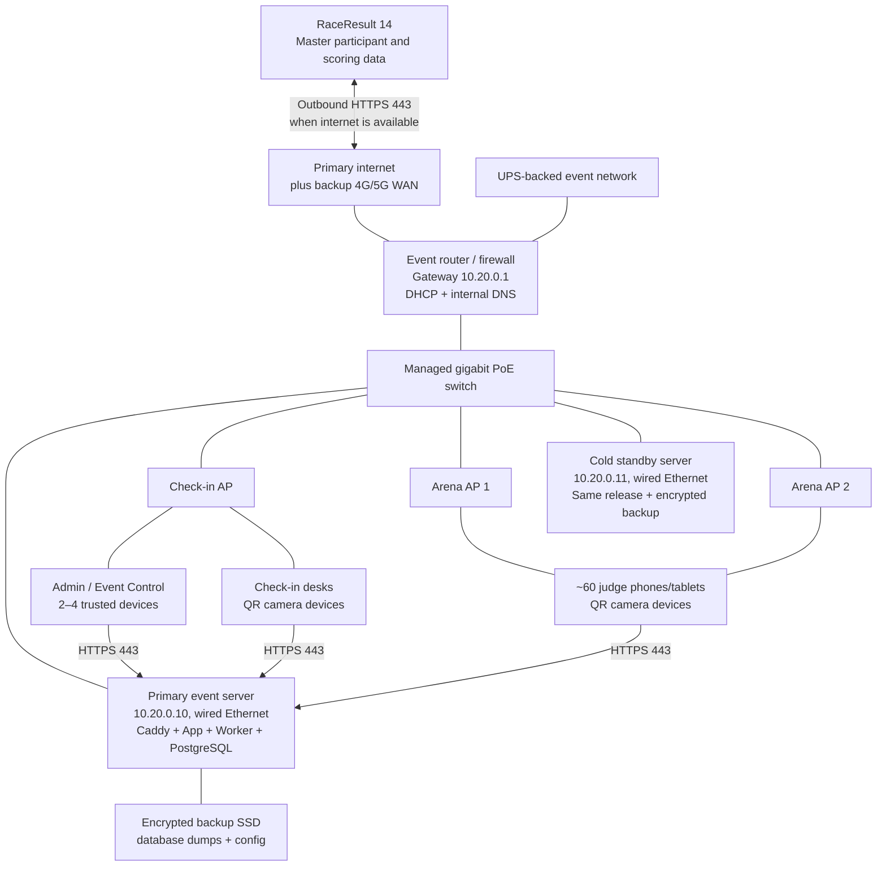

# HYFIT Games Local Race Network and Operations Runbook

Status: Team review

Audience: Networking, IT, event control, check-in, judging, and RaceResult operations

Platform: HYFIT Games Judge App modular monolith

Last updated: 28 July 2026

## 1. Purpose

This runbook describes how to operate the complete HYFIT platform from one
local event server while approximately 60 judges and multiple check-in,
administration, and event-control devices use it over a private arena network.

RaceResult 14 remains the system of record. The local PostgreSQL database is the
event-day operational store: it holds the latest imported participant snapshot,
assignments, check-ins, judging records, audit history, and pending RaceResult
updates. Internet loss must not prevent local check-in or judging. It will delay
RaceResult imports and outbound updates until connectivity returns.

The design priorities, in order, are:

1. Athlete and event safety.
2. Preserve every locally accepted transaction and its audit trail.
3. Keep check-in and judging available on the arena LAN.
4. Reconcile all accepted changes with RaceResult.
5. Restore normal service without creating two active servers.

## 2. Recommended topology



Network plan:

| Item | Recommended value |
|---|---|
| Operations subnet | `10.20.0.0/24` |
| Gateway/router | `10.20.0.1` |
| Primary server reservation | `10.20.0.10` |
| Cold standby reservation | `10.20.0.11` |
| Infrastructure range | `10.20.0.2–49` |
| Client DHCP pool | `10.20.0.50–220` |
| Operations SSID | `HYFIT-OPS` |
| Public/guest SSID | Separate VLAN and subnet; no access to operations LAN |
| App address | A controlled hostname such as `race.<owned-domain>` |

The addresses are examples. The networking team may change them, but must keep
the final values consistent in DHCP reservations, DNS, firewall rules, server
documentation, standby procedure, and printed quick cards.

## 3. Non-negotiable network rules

- Connect both servers and all access points to the switch by Ethernet.
- Do not run the event server over Wi-Fi.
- Do not enable wireless client isolation on `HYFIT-OPS`.
- Do not expose PostgreSQL port `5432` or application port `4320` to clients.
- Do not configure internet port forwarding to the event server.
- Permit client devices to reach the server on TCP `443`.
- Permit the server to reach RaceResult and required time/DNS services
  outbound. RaceResult traffic uses HTTPS.
- Keep spectators, athlete guests, livestreaming, and production media off the
  operations SSID.
- Put the router, switch, access points, primary server, and backup modem on UPS
  power.
- Use one active event server at a time. Never start the standby with the
  primary still serving traffic.
- Do not use an internet tunnel as the normal race-day entry point. It adds an
  internet dependency and unnecessarily exposes the service.

## 4. HTTPS and mobile camera decision

Mobile browsers permit camera access only in a secure context. For arena phones,
that means the app must be opened over trusted HTTPS; a plain address such as
`http://10.20.0.10:4320` is not a supported QR-scanning endpoint.

Choose one of these models during the network rehearsal:

### Model A — recommended for mixed or personal devices

Use a subdomain owned by HYFIT, for example `race.example.com`, and a
publicly trusted certificate. Configure the event router's internal DNS so that
the name resolves to `10.20.0.10` while devices are on `HYFIT-OPS`.

Acquire and test the certificate before event day. DNS-based certificate
validation is preferable because it does not require exposing the local server
to inbound internet traffic. Store the certificate and renewal procedure with
the event configuration.

### Model B — acceptable for a managed device fleet

Use Caddy's internal CA, as the repository currently does for
`https://hyfit.local`. Export the Caddy root certificate, install it as trusted
on every judge/check-in device, and confirm camera access before issuing the
device. Merely accepting a browser warning is not an operational substitute for
installing and trusting the CA.

Do not switch to HTTP if certificate trust fails. Repair DNS/certificate trust
or issue a prepared replacement device.

## 5. Required equipment

Minimum race kit:

- One primary Mac mini, Mac laptop, Windows mini PC, or Windows laptop with
  Ethernet and enough storage for logs and backups.
- One cold standby machine with the same application release and container
  images.
- Business-class router/firewall with DHCP reservations, local DNS, dual-WAN
  capability, and configuration export.
- Managed gigabit switch, preferably PoE.
- Enough wired access points for measured arena coverage and at least 100
  concurrent clients.
- UPS units sized for the router, switch, access points, servers, and modem.
- Primary wired internet plus an independently tested 4G/5G backup WAN.
- Two encrypted external SSDs for alternating database backups.
- Spare preconfigured router, access point, Ethernet cables, power supplies,
  QR-capable phone/tablet, and labelled charging equipment.
- One infrastructure laptop with wired access and offline copies of this
  runbook, router configuration, application release, and recovery keys.

Do not choose access-point quantity from floor area alone. Perform an on-site
survey with the barriers, crowd density, timing equipment, broadcast equipment,
and check-in structures expected on race day.

## 6. Server preparation

### Common preparation

1. Create a dedicated local operations administrator account.
2. Apply OS and firmware updates before the final rehearsal, then freeze
   versions. Do not allow automatic reboots during the event.
3. Enable disk encryption and securely escrow its recovery key.
4. Reserve the server MAC address as `10.20.0.10` in DHCP.
5. Use Ethernet and disable sleep, hibernation, and disk sleep during the event.
6. Enable restart after power loss where the hardware supports it.
7. Enable automatic time synchronization and verify the timezone.
8. Install Docker Desktop/Engine and Docker Compose, or document the approved
   native Node.js/PostgreSQL alternative.
9. Clone the approved Git release and record its commit hash.
10. Create the environment file with unique strong values for
    `POSTGRES_PASSWORD` and `SESSION_SECRET`. Restrict access to that file.
11. Configure the event and both RaceResult endpoints in Admin Control.
12. Change all bootstrap PINs before staff onboarding.

### macOS host

- In System Settings → Network → Firewall, allow the approved container
  runtime/Caddy service to receive connections. Do not disable the firewall.
- In System Settings → Privacy & Security → Local Network, allow the required
  runtime or terminal process if macOS requests access.
- In System Settings → Energy, prevent automatic sleep and enable restart after
  power failure when available.
- Disable Wi-Fi on the server after confirming wired network and remote
  administration.
- Prevent unattended OS updates and restart prompts during the operational
  window.

### Windows host

- Set only the dedicated event Ethernet network to the **Private** profile.
- Create a Windows Defender Firewall inbound allow rule for TCP `443`, limited
  to the Private profile and the local operations subnet.
- Do not create inbound client rules for `4320` or `5432`.
- Disable sleep and hibernation while connected to event power.
- Prevent unattended update restarts during the operational window.
- If Docker Desktop uses WSL 2, rehearse a full Windows restart and confirm that
  containers, firewall rules, and the server address return correctly.

## 7. Application deployment

From the approved repository checkout:

```bash
docker compose up -d --build
docker compose ps
```

The included deployment has these boundaries:

- Caddy publishes host ports `80` and `443`.
- Caddy proxies internally to the app on `4320`.
- The app and worker connect internally to PostgreSQL on `5432`.
- PostgreSQL, app, and worker do not publish client-facing host ports.

Before use, replace the example hostname in `ops/Caddyfile` with the rehearsed
hostname and certificate model. After startup:

1. Open Admin Control over HTTPS.
2. Confirm the correct event is published.
3. Run **Sync now** in the Participants section.
4. Verify imported, updated, unchanged, and rejected counts.
5. Resolve every rejected participant or explicitly document the accepted
   exception.
6. Confirm the RaceResult outbox is empty.
7. Complete one controlled check-in, penalty, undo, and Final Finish test using
   designated test BIBs.
8. Confirm the expected fields arrived in RaceResult.
9. Remove or reset the test transactions before opening operations.

The current participant import is operator-triggered through **Sync now**.
Assign a named RaceResult operator to repeat it at the agreed cadence; do not
assume a background schedule exists unless it has been separately enabled and
tested.

## 8. Device onboarding

Prepare and label devices before the event:

1. Join `HYFIT-OPS` and verify the device receives a `10.20.0.x` address.
2. Remove or deprioritize public/guest arena Wi-Fi.
3. Disable features that automatically abandon Wi-Fi when the internet becomes
   unavailable. The operations LAN remains useful during a WAN outage.
4. Install and trust the local CA if certificate Model B is used.
5. Open the official HTTPS app address and bookmark/add it to the home screen.
6. Allow camera access when prompted.
7. Sign in with the device's assigned role and account.
8. Scan a participant BIB QR and, for check-in devices, wristband and
   Transponder1 test QRs.
9. Lock screen rotation if the selected workflow benefits from it.
10. Attach a label showing device number, role, desk/station, and support number.

Never share an Admin account with judges or volunteers. Use individual or
operationally attributable staff accounts so audit records identify the actor.

## 9. Port and traffic matrix

| Source | Destination | Protocol/port | Purpose | Policy |
|---|---|---:|---|---|
| Judge/check-in/admin devices | Caddy on primary | TCP 443 | App and QR workflows | Allow from operations subnet |
| Client browsers | Caddy on primary | TCP 80 | HTTPS redirect only | Optional; allow from operations subnet |
| Primary app | RaceResult | TCP 443 outbound | Participant fetch and field updates | Allow |
| Primary server | DNS resolver | UDP/TCP 53 | Name resolution | Allow to approved resolver |
| All infrastructure | Time source | UDP 123 | Clock synchronization | Allow |
| Caddy container | App container | TCP 4320 | Internal reverse proxy | Container network only |
| App/worker containers | PostgreSQL | TCP 5432 | Internal database access | Container network only |
| Infrastructure laptop | Router/AP/server | Vendor management ports | Administration | Restricted administrator path only |

If remote shell access is enabled, restrict it to the infrastructure laptop or
an administration VLAN. Do not allow it from every judge device.

## 10. Readiness timeline

### T−14 to T−7 days

- Complete the radio/site survey and capacity test.
- Freeze server, router, access-point, browser, and application versions.
- Test both internet links and deliberate WAN failover.
- Test the public certificate or install the local CA on every managed device.
- Load-test with at least the expected 60 judges plus check-in and admin devices.
- Rehearse RaceResult fetch, update, rejection, retry, conflict, penalty undo,
  and Final Finish lock.
- Restore a database backup onto the standby and verify logins and sample data.
- Export router/AP configuration and print the quick-reference section.

### T−1 day

- Deploy the final approved application commit to primary and standby.
- Verify all passwords, PINs, certificates, and event mappings.
- Run a fresh participant sync and reconcile rejected records.
- Confirm UPS runtime and label every power/network lead.
- Charge and test every field device and spare.
- Make two encrypted database backups; store one away from the primary server.

### T−2 hours

- Power infrastructure in the sequence in section 11.
- Check access-point health, channel use, client counts, and WAN status.
- Run participant sync and record its timestamp and totals.
- Confirm outbox pending/conflict counts are zero.
- Execute the controlled end-to-end test.
- Freeze configuration. From this point, changes require Event Control approval
  and must be written in the incident log.

## 11. Race-day startup and shutdown

### Startup order

1. UPS units and power distribution.
2. Primary/backup WAN modems.
3. Router/firewall.
4. Switch and access points.
5. Primary server.
6. Application stack and health checks.
7. Admin/Event Control devices.
8. Check-in devices.
9. Judge devices.
10. Participant sync, RaceResult update test, and operational release.

Event Control should not open check-in until the infrastructure lead,
RaceResult operator, and check-in lead all sign the readiness sheet.

### Shutdown order

1. Announce the final transaction time and stop new claims/check-ins.
2. Confirm all judge sessions are Final Finished or formally handed over.
3. Confirm RaceResult outbox pending/conflict counts are zero, or export the
   unresolved list with an owner.
4. Run and verify the final participant/RaceResult reconciliation.
5. Create two encrypted backups and test that the dump can be read.
6. Export the audit and incident records required by Event Control.
7. Stop the application cleanly.
8. Shut down the primary server, then network equipment.
9. Move one backup off-site under the retention policy.

## 12. Roles and decision authority

| Role | Owns |
|---|---|
| Event Control lead | Opens/closes operations; authorizes configuration changes and failover |
| Infrastructure lead | Server, router, switch, APs, UPS, certificates, monitoring, recovery |
| RaceResult operator | Participant sync, field mappings, outbound reconciliation, conflicts |
| Check-in lead | Desk readiness, replacements, duplicate assignment escalation |
| Judge lead | Judge onboarding, station/device replacement, incomplete sessions |
| Incident scribe | Timeline, symptoms, decisions, actors, recovery, unresolved work |

Only the Event Control lead may authorize a server failover. Only the
infrastructure lead performs it. This prevents split-brain operation.

## 13. Monitoring during operations

Display or record at least every 15 minutes:

- Primary server CPU, memory, disk free space, and container health.
- PostgreSQL health and most recent successful backup.
- Connected client count per access point, retransmissions, and channel load.
- Primary and backup WAN status.
- Last participant sync time and result counts.
- RaceResult outbox pending, retrying, and conflict counts.
- Active check-in and judging sessions.
- Application error rate and slow requests.
- UPS state and estimated runtime.

Escalate before failure: disk free space below 20%, repeated container restarts,
rapidly growing outbox, access point overload, rising scan failures, or backup
age exceeding the agreed recovery point.

## 14. Failure and recovery playbooks

### A. Internet or RaceResult is unavailable

**Impact:** Existing local participants remain available. New imports and
RaceResult updates pause; outbound records remain pending.

1. Keep judges and check-in operating on `HYFIT-OPS`.
2. Tell users not to change Wi-Fi networks.
3. Confirm the local app and database remain healthy.
4. Fail WAN over to the tested backup link if Event Control authorizes it.
5. Monitor pending outbound work; do not repeatedly resubmit it manually.
6. When service returns, let the worker replay pending updates.
7. Resolve conflicts with the RaceResult operator and record the final outcome.

### B. A judge/check-in device fails

1. Preserve the failed device; do not wipe browser data.
2. Issue a labelled spare on `HYFIT-OPS`.
3. Sign in with the correct attributable account.
4. Resume from the centrally stored athlete/session state.
5. If the failed browser reports unsent local work, give it to infrastructure
   for recovery and do not duplicate the transaction on both devices.
6. Revoke the abandoned session when safe.

### C. Camera or QR scanning fails

1. Confirm the page address begins with `https://`.
2. Confirm the browser trusts the certificate without a warning.
3. Confirm camera permission is allowed for the site in browser/OS settings.
4. Close other apps using the camera and reload the page.
5. Confirm the correct rear camera is selected and clean the lens.
6. Use numeric BIB/manual-code entry only as the documented fallback; verify the
   athlete details before assigning wristband or Transponder1.
7. Replace the device if trust or camera permission cannot be repaired quickly.

### D. Wi-Fi dead zone or access point failure

1. Move the affected device to the nearest known-good operations area.
2. Check AP power, Ethernet link, client count, and channel load.
3. Move clients or enable the preconfigured spare AP without changing SSID,
   password, or subnet.
4. Do not create an improvised phone hotspot with the same SSID.
5. Record the location and device counts before and after recovery.

### E. Router failure

1. Confirm it is the router—not the server, switch, DNS, or one AP.
2. Disconnect the failed router.
3. Install the preconfigured spare with the same LAN address, DHCP reservations,
   DNS record, SSID/security settings, and firewall policy.
4. Verify that only one DHCP server is active.
5. Test one admin, one check-in, and one judge device before releasing traffic.

### F. Application container/process failure

1. Confirm PostgreSQL remains healthy.
2. Capture current logs and the incident time.
3. Restart only the failed application/worker service.
4. Verify login, participant lookup, active session recovery, and outbox.
5. Do not restore the database for an application-only failure.

### G. PostgreSQL or primary server failure

1. Event Control pauses new check-ins and judging mutations.
2. Infrastructure isolates the primary from both network and power.
3. Record the last known transaction, backup time, and pending outbox state.
4. Restore the most recent verified backup to the cold standby.
5. Assign the standby the primary service identity (`10.20.0.10` and the
   official hostname), or change internal DNS according to the rehearsed plan.
6. Start the stack and verify event, staff, participants, active sessions,
   check-ins, audit history, and outbox.
7. Complete one controlled read and write test.
8. Event Control releases operations and records the recovery point.
9. Keep the failed primary isolated until post-event reconciliation. Never
   reconnect it as a second active server.

### H. Power failure

1. Confirm UPS status and expected remaining runtime.
2. Preserve router, switch, APs, and primary server before nonessential loads.
3. If stable power will not return inside the shutdown threshold, stop new
   work, take a final backup, and shut the server down cleanly.
4. After power returns, use the normal startup order and reconciliation checks.

### I. Disk space, certificate, DNS, or clock failure

- **Disk:** Stop log growth/export safely, make space under the retention plan,
  then verify PostgreSQL and backup integrity. Never delete database files.
- **Certificate:** Repair the certificate chain/trust. Do not direct QR devices
  to HTTP.
- **DNS:** Check the router's DNS record and client lease. An IP-address
  workaround is valid only if the trusted certificate explicitly covers it.
- **Clock:** Restore NTP, then review transactions created during the drift
  window; do not rewrite audit timestamps casually.

### J. Duplicate wristband/transponder or data mismatch

1. Do not bypass the database uniqueness rejection.
2. Verify the athlete by BIB and identity details.
3. The check-in lead performs the authorized replacement/reassignment workflow.
4. Confirm the change reached RaceResult.
5. Preserve both the original and corrective audit records.

## 15. Cold-standby rules

The standby is not automatic high availability. It is a rehearsed recovery
machine.

- Keep the same OS/container architecture, application commit, and configuration
  structure as primary.
- Store secrets securely; do not put them in Git.
- Restore and test a recent backup during rehearsal.
- Keep it normally stopped or otherwise unable to serve production traffic.
- Maintain an explicit “primary active / standby isolated” status card.
- A failover changes the single active server. It is not a temporary second
  server.

Proposed service targets for team approval:

| Failure | Recovery time target | Recovery point target |
|---|---:|---:|
| App/worker restart | 5 minutes | No committed DB loss |
| AP/router replacement | 10 minutes | No committed DB loss |
| Primary server replacement | 20 minutes | Most recent verified backup plus recoverable queued client work |
| WAN/RaceResult outage | Local operation continues | All accepted outbound updates retained until replay |

The team must validate these targets through timed drills; they are not
guarantees merely because they appear in this document.

## 16. Acceptance test

The platform is race-ready only after a full dress rehearsal passes:

- At least 75 concurrent devices join the operations network.
- Every arena station and check-in desk can resolve the official hostname and
  open it with a trusted HTTPS connection.
- QR scanning works on representative iOS and Android devices.
- Participant lookup, judge claim, penalty, undo, Final Finish, check-in,
  wristband assignment, and Transponder1 assignment succeed.
- RaceResult receives the expected field updates.
- Duplicate wristband/transponder assignments are rejected.
- Internet is deliberately disconnected; local reads and writes continue and
  queued updates later reconcile.
- One AP is removed; affected users recover through another or the spare.
- The app process is restarted without losing committed work.
- A database backup is restored on the standby in the agreed recovery time.
- Primary is isolated before standby assumes the production identity.
- Audit and incident records identify the actor and corrective action.

## 17. Printable race-day quick card

**Normal app address:** `https://____________________________`

**Operations SSID:** `HYFIT-OPS`

**Primary server:** `10.20.0.10`

**Standby server:** `10.20.0.11`

**Event Control lead:** `________________`

**Infrastructure lead:** `________________`

**RaceResult operator:** `________________`

If a user cannot connect:

1. Confirm `HYFIT-OPS`.
2. Confirm a `10.20.0.x` address.
3. Confirm the official HTTPS hostname and no certificate warning.
4. Test another operations device.
5. Check AP, server health, and DNS—in that order.

If the internet fails:

- Keep using the local app.
- Do not leave `HYFIT-OPS`.
- Notify the RaceResult operator.
- Watch the outbox and reconcile after recovery.

If the primary server fails:

- Pause mutations.
- Isolate primary.
- Event Control authorizes standby.
- Restore, verify, then release.
- Never operate both servers.

## 18. Team decisions to record before sign-off

| Decision | Final value / owner |
|---|---|
| Arena subnet and DHCP range | |
| Primary and standby hardware | |
| Official HTTPS hostname | |
| Public certificate or managed local CA | |
| Router/AP models and placement | |
| Primary and backup internet providers | |
| UPS shutdown threshold | |
| Participant sync cadence | |
| Backup cadence and retention | |
| Approved application commit | |
| Failover authority and recovery targets | |
| Incident communication channel | |

## 19. Authoritative references

- [MDN: `getUserMedia()` secure-context and permission requirements](https://developer.mozilla.org/en-US/docs/Web/API/MediaDevices/getUserMedia)
- [Caddy: Automatic HTTPS and local CA trust](https://caddyserver.com/docs/automatic-https#local-https)
- [Apple: Configure the macOS firewall](https://support.apple.com/guide/mac-help/block-connections-to-your-mac-with-a-firewall-mh34041/mac)
- [Apple: Control local-network access on macOS](https://support.apple.com/guide/mac-help/control-access-to-your-local-network-on-mac-mchla4f49138/mac)
- [Microsoft: Windows Firewall rules](https://learn.microsoft.com/en-us/windows/security/operating-system-security/network-security/windows-firewall/rules)
- [Microsoft: Windows Firewall overview](https://learn.microsoft.com/en-us/windows/security/operating-system-security/network-security/windows-firewall/)
# Two-stage athlete Check-In

Configure every Check-In counter in Event Control as one of:

- **Stage 1 · Check-In & Wristband**
- **Stage 2 · Arena Transponder**

Assign each volunteer to the counter where they are physically working. The
volunteer cannot change stages from the Check-In screen.

Create these case-sensitive fields in RaceResult before race day:

| Stage | RaceResult field | Value sent |
|---|---|---|
| Stage 1 | `stage1checkin` | `COMPLETED` |
| Stage 1 | `stage1checkintime` | Event-local `YYYY-MM-DD HH:mm:ss` |
| Stage 1 | `wristbandID` | Scanned wristband code |
| Stage 2 | `stage2checkin` | `COMPLETED` |
| Stage 2 | `stage2checkintime` | Event-local `YYYY-MM-DD HH:mm:ss` |
| Stage 2 | `Transponder1` | Scanned transponder code |

Stage 1 requires a Government-ID visual check but never stores the ID number or
an ID image. Photo and signature capture are independent Admin settings and are
OFF by default. When media capture is used, configure `CHECKIN_MEDIA_DIR` on a
persistent local volume and schedule:

```sh
npm run media:cleanup
```

Run cleanup daily. The default retention is 30 days after the event and can be
changed in Event Control.

Each stage saves locally before RaceResult delivery. **Sync pending** means the
handover is accepted and the volunteer should continue with the next athlete.
The worker retries automatically when internet connectivity returns. If the
local server itself is unavailable, stop handovers until it is restored.

Identity mismatches go to the Event Control **Exceptions** tab. Only an Event
Admin may record an override or rejection reason. Active wristband or
transponder assignments must never be silently reused.
